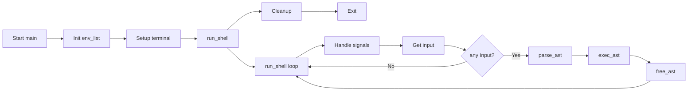
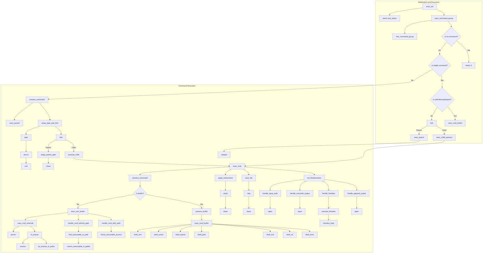

English | [日本語](./docs/Readme-ja.md) | [繁體中文](./docs/Readme-zh.md)


# Minishell - As Beautiful as a Shell
<p align="left">
  
  
  
  
</p>
<p align="center">
  
</p>
Minishell is a mini shell project written in C that mimics the basic functionalities of Bash.
While learning about process management, file descriptors, and signal handling, We built our own command-line interface.
We paid special attention to accurately replicating bash's behavior regarding exit status values and error messages, ensuring that our shell responds to errors in a consistent and familiar way for users accustomed to bash.

## Features
- **Interactive Prompt:** Displays a prompt for user input.
- **Command Execution:** Runs commands using the `PATH` variable or relative/absolute paths.
- **Redirections & Pipes:** Supports input/output redirection (`<`, `>`, `<<`, `>>`) and piping (`|`).
- **Environment Variables:** Expands variables (e.g., `$VAR` and `$?` for exit status).
- **Signal Handling:** Properly responds to Ctrl-C, Ctrl-D, and Ctrl-\.

## Built-in Commands
| Command   | Description                                                                              |
|-----------|------------------------------------------------------------------------------------------|
| `echo`    | Prints text to the terminal (supports `-n` option to omit newline).                      |
| `cd`      | Changes the current directory                                                            |
| `pwd`     | Displays the current working directory.                                                  |
| `export`  | Sets environment variables.                                                              |
| `unset`   | Removes environment variables.                                                           |
| `env`     | Lists all environment variables.                                                         |
| `exit`    | Exits the shell.        

## Norminette Compliance
This project strictly adheres to the 42 School Norminette rules (v3.3.55). The Norminette enforces a consistent coding style across all C projects at 42, including:

- 25 lines maximum per function
- 80 characters maximum per line
- Only 5 functions maximum per file
- Specific variable declaration and naming conventions
- Restricted use of standard library functions
- Structured function header format
- No for loops, switch statements, or do-while loops
- Required use of tabs for indentation

All code in this repository passes the official 42 Norminette validator without errors.

>

## Final grade


Validated : 09/03/2025

Mandatory part : 100/100

Bonus : 0/15


## Flowchart of Main



## Flowchart of Execution Part


## Installation
1. **Clone the repository:**
   ```bash
   git clone https://github.com/yourusername/minishell.git
   ```
2. **Navigate to the project directory:**
   ```bash
   cd minishell
   ```
3. Compile the project:
   ```bash
    make
   ```

## Usage
- Start the Shell:
  ```bash
  ./minishell
  ```
- Enter commands at the prompt.
- Exit by typing exit or pressing Ctrl-D.


