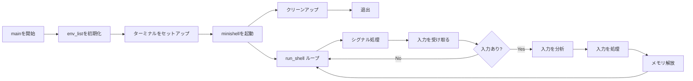
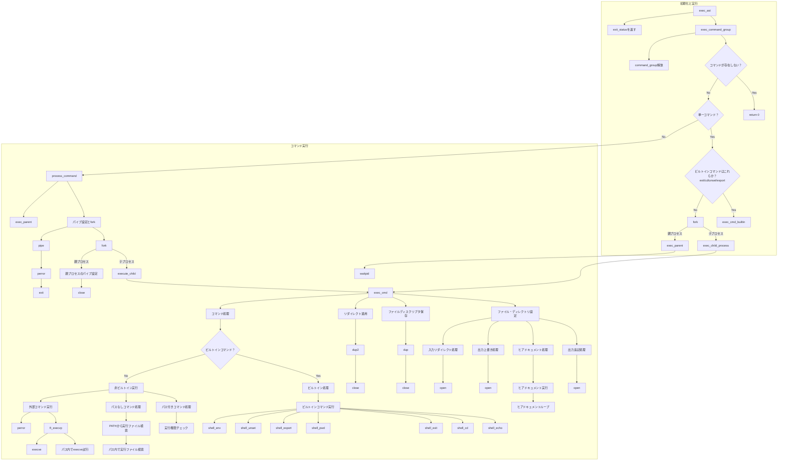

[English](../Readme.md) | 日本語 | [繁體中文](./Readme-zh.md)

# Minishell - 美しいシェル
<p align="left">
  
  
  
  
</p>
<p align="center">
  
</p>
Minishellは、Bashの基本機能を模倣したCで書かれたミニシェルプロジェクトです。
プロセス管理、ファイルディスクリプタ、シグナル処理について学びながら、独自のコマンドラインインターフェースを構築しました。
終了ステータス値とエラーメッセージに関してbashの動作を正確に再現することにも特に注意を払い、bashに慣れたユーザーにとって一貫性のある親しみやすい方法でエラーに対応するシェルを確保しました。

## 機能
- **インタラクティブプロンプト:** ユーザー入力用のプロンプトを表示します。
- **コマンド実行:** `PATH`変数または相対/絶対パスを使用してコマンドを実行します。
- **リダイレクトとパイプ:** 入出力リダイレクト（`<`、`>`、`<<`、`>>`）とパイプ（`|`）をサポートします。
- **環境変数:** 変数を展開します（例：`$VAR`および終了ステータス用の`$?`）。
- **シグナル処理:** Ctrl-C、Ctrl-D、Ctrl-\に適切に対応します。

## ビルトインコマンド
| コマンド   | 説明                                                                  |
|-----------|---------------------------------------------------------------------|
| `echo`    | テキストを端末に出力します（改行を省略する `-n` オプションをサポート）。   |
| `cd`      | カレントディレクトリを変更します。                                     |
| `pwd`     | 現在の作業ディレクトリを表示します。                                   |
| `export`  | 環境変数を設定します。                                               |
| `unset`   | 環境変数を削除します。                                               |
| `env`     | すべての環境変数を一覧表示します。                                     |
| `exit`    | シェルを終了します。                                                 |

## Norminetteへの準拠
このプロジェクトは、42 School Norminetteルール（v3.3.55）に厳密に準拠しています。Norminetteは、42のすべてのCプロジェクトで一貫したコーディングスタイルを強制するものであり、以下のようなルールがあります：

- 関数あたり最大25行
- 1行あたり最大80文字
- ファイルあたり最大5関数
- 特定の変数宣言と命名規則
- 標準ライブラリ関数の使用制限
- 構造化された関数ヘッダーフォーマット
- forループ、switch文、do-whileループの禁止
- インデントにタブの使用が必須

このリポジトリのすべてのコードは、公式の42 Norminette検証ツールでエラーなく合格しています。

>

## 最終評価


検証日：2025年3月9日

必須部分：100/100

ボーナス：0/15

## フローチャート（メイン）



##  フローチャート（出力処理）


## インストール方法
1. **リポジトリをクローンする:**
   ```bash
   git clone https://github.com/yourusername/minishell.git
   ```
2. **プロジェクトディレクトリに移動:**
   ```bash
   cd minishell
   ```
3. プロジェクトをコンパイル:
   ```bash
    make
   ```

## 使用方法
- シェルを起動:
  ```bash
  ./minishell
  ```
- プロンプトでコマンドを入力。
- 終了するには「exit」と入力するか、Ctrl-Dを押します。
