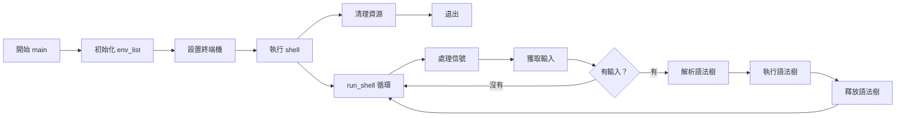
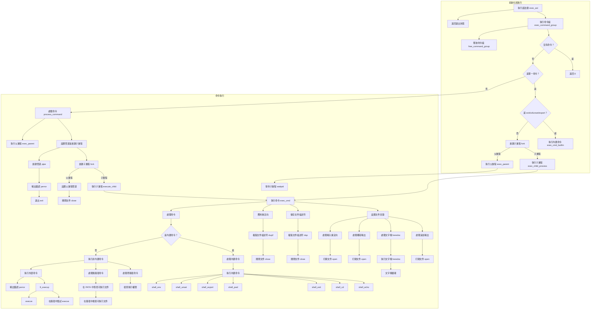

[English](../Readme.md) | [日本語](./Readme-ja.md) | 繁體中文

# Minishell - 如shell般美麗
<p align="left">
  
  
  
  
</p>
<p align="center">
  
</p>

Minishell 是一個用 C 語言編寫的迷你Shell專題，模仿 Bash 的基本功能。
在學習程序管理、檔案描述符和訊號處理的同時，構建了自己的命令列介面。
我們特別注重精確地複製 bash 在退出狀態值和錯誤訊息方面的行為，確保minishell以一種一致且熟悉的方式回應錯誤，適合已習慣使用 bash 的使用者。

## 功能特點
- **互動提示符：** 顯示使用者輸入提示符。
- **命令執行：** 使用 `PATH` 變數或相對/絕對路徑執行命令。
- **重定向和管道：** 支援輸入/輸出重定向（`<`、`>`、`<<`、`>>`）和管道（`|`）。
- **環境變數：** 展開變數（例如，`$VAR` 和 `$?` 用於退出狀態）。
- **訊號處理：** 正確回應 Ctrl-C、Ctrl-D 和 Ctrl-\。

## 內建命令
| 命令      | 描述                                                          |
|-----------|--------------------------------------------------------------|
| `echo`    | 在終端上輸出文字（支援 `-n` 選項省略換行符）。                 |
| `cd`      | 更改當前目錄。                                                |
| `pwd`     | 顯示當前工作目錄。                                            |
| `export`  | 設定環境變數。                                                |
| `unset`   | 移除環境變數。                                                |
| `env`     | 列出所有環境變數。                                            |
| `exit`    | 退出minishell。                                                    |

## Norminette 規範遵循
本專題嚴格遵循 42 School Norminette 規則（v3.3.55）。
Norminette 在所有 42 的 C 專題中強制執行一致的編碼風格，包括：

- 每個函數最多 25 行
- 每行最多 80 個字元
- 每個檔案最多 5 個函數
- 特定的變數宣告和命名慣例
- 限制使用標準庫函數
- 結構化的函數標頭格式
- 禁止使用 for 、switch 或 do-while 
- 必須使用 tab 作為縮排

本儲存庫中的所有程式碼都能通過官方 42 Norminette 驗證器而不產生錯誤。

>

## 最終成績


提交日期：2025年3月9日

必修部分：100/100

bonus部分：0/15

## flowchart（主幹部分）



##  flowchart（執行部分）


## 安裝
1. **複製儲存庫：**
   ```bash
   git clone https://github.com/yourusername/minishell.git
   ```
2. **進入專題目錄：**
   ```bash
   cd minishell
   ```
3. **使用Makefile編譯(Compile)專題**：
   ```bash
    make
   ```

## 使用方法
- 啟動minishell：
  ```bash
  ./minishell
  ```
- 在提示符處輸入命令。
- 輸入 exit 或按 Ctrl-D 退出。
